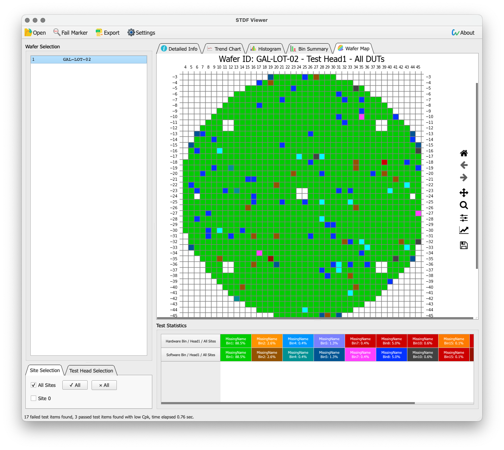
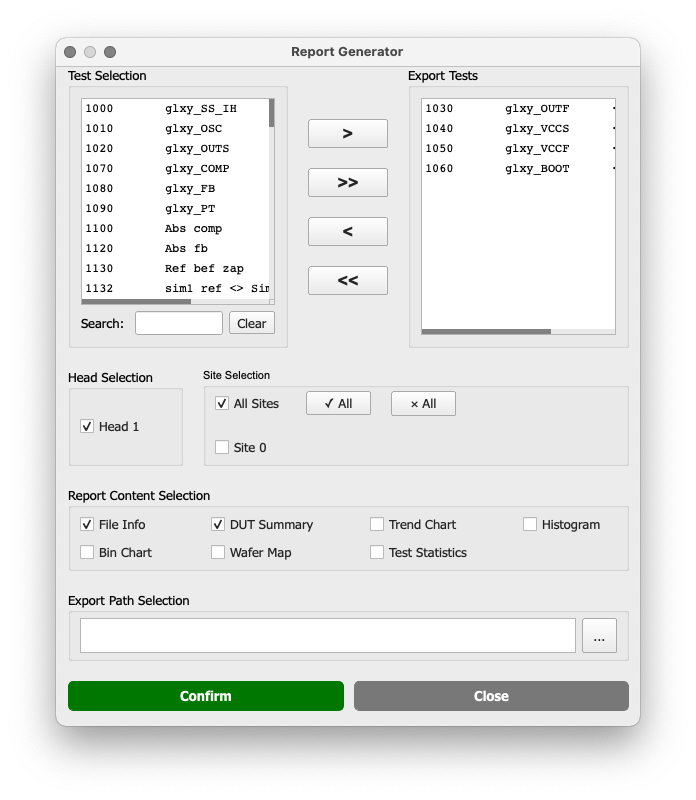
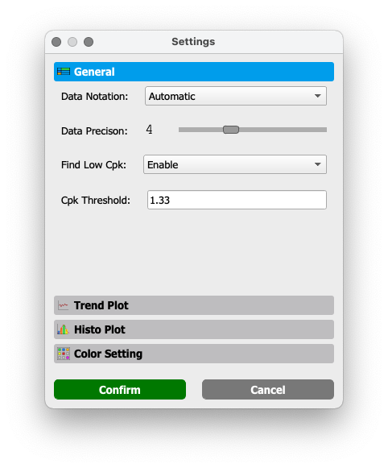

# STDF Viewer 

  

STDF Viewer is a free, fast and powerful GUI tool to visualize STDF (semiconductor Standard Test Data Format) data files.

Devloped by Noon Chen <chennoon233@foxmail.com>

## Usage

### **Open a STDF file**

STDF Viewer supports files under [STDF Version 4 Specification](http://www.kanwoda.com/wp-content/uploads/2015/05/std-spec.pdf), GZ and BZIP compressed STDF files can also be opened without decompression.

STDF files can be opened in 3 ways:

1. Select a STDF file in a file dialog by clicking `open` button on the toolbar.
2. Right click on a STDF file and select STDF Viewer to open.
3. Drag a STDF file into the GUI to open.

 

### **Find failed test items**

By clicking the `Fail Marker` button on the toolbar can paint all failed test items in red, if the `Find Low Cpk` is enabled in `Settings`, test items with Cpk lower than the threshold (can be set in `Settings`) will be painted in orange.

 

### **Looking for DUTs' info**

DUTs' info can be viewed in `Detailed Info` -> `DUT Summary`. Each line in the table represents a single DUT, and it will be marked in red if this DUT is failed.

If STDF files contain multiple heads and/or sites, you may also filter out the DUTs of non-interest by selecting specific heads and/or sites in `Site/Head Selection`.

DUTs' info can be sorted by any columns. For instance, the screenshot below showing the result of sorting the DUTs by flags.

 

### **Analyzing test data**

***Importance Notice**: Functional Tests (FTR) have no test value, instead, the test flag is used as the test value for drawing trend charts and histograms; Multiple Parameter Tests (MPR) are currently not supported, because I don't have a STDF file contains MPR records to test :(*

All test items in the STDF file will be shown in the `Test Selection`, in which you can select single or multiple test item(s). The search box below can help you find test item(s) more easily.

Statistic (Cpk, mean, std dev, etc.) of the test items in the selected heads and sites is displayed in `Test Statistics`.

#### **Test data**
Select test item(s) and then navigate to `Detailed Info` -> `Test Summary`. Each row is a DUT that's been tested in the selected heads and sites, data of selected tests will be appended to the rightmost column.

#### **Trend chart**
Display interactive trend charts of test item(s), y axis is the value of the test item, x axis is the index of DUTs that's been tested in selected head and site.

Elements can be shown/hidden in `Settings`:
 - Upper limit
 - Lower limit
 - Mean line
 - Median line

#### **Histogram**
Display histograms of test item(s), x axis is the test value distribution, y axis is the DUT counts of each bin.

Elements can be shown/hidden in `Settings`:
 - Upper limit
 - Lower limit
 - Mean line
 - Median line
 - σ lines
 - Gaussian curve
 - Boxplot
 - Color

 

### **Read all test data of specific DUTs**
In some cases, it would be helpful to see the detailed test results of some DUTs, as shown below. It can be achieved by several methods in the STDF Viewer.

#### **In `DUT Summary`**
Select row(s) of interest and right click, click `Read selected DUT data` in the context menu.

#### **In `Test Summary`**
Select cell(s) of interest and right click, click `Read selected DUT data` in the context menu.

#### **In `Trend Chart`**
Click on the data point (or press `Shift` to select multiple), when the point(s) are marked by *`S`*, press `Enter` on the keyboard.

 

### **Analyzing bin distribution**
Display histograms of hardware bin and software bin of selected heads and sites. 

`Test Statistic` displays the bin name, bin number and precentage, for the bins with DUT counts of 0 will be hidden.

 

### **Viewing wafer maps**
If STDF files contain wafer information (WIR, WRR records), the `Wafer Map` tab will be enabled.

 

### **Generating a STDF report**
Almost all information displayed on STDF Viewer can be exported to a Excel report.

Each checkbox in `Report Content Selection` will be saved in a individual sheet in the report. 

The numbers of figures/data in the report are based on numbers of tests in `Export Tests` and selected Heads and Sites.

 

### **Settings**
STDF Viewer offers a global setting, which can change the appearance of figures, colors of each sites/bins, etc. in STDF Viewer or the exported report. 

The description should be self-explanatory, feel free to play it around.

## Acknowledgements

STDF Viewer uses code from the following open sources, much thanks to their authors.
 - [zlib](https://zlib.net/)
 - [bzip2](https://www.sourceware.org/bzip2/)
 - [sqlite3](https://www.sqlite.org/)
 - [hashmap](https://gist.github.com/warmwaffles/6fb6786be7c86ed51fce)
 - [message_queue](https://github.com/LnxPrgr3/message_queue)

 Not used in version 3.0.5 and above:
 - ~~[pystdf](https://github.com/cmars/pystdf)~~

 

## License

STDF Viewer is licensed under GPL V3.0, which means the software is free but I don't take any responsibilites if anything goes wrong due to the usage of the STDF Viewer, it is always safe to be skeptical about the results or images on the STDF Viewer.

The icons that I designed for STDF Viewer is licensed under [Attribution-NonCommercial 4.0 (CC BY-NC 4.0)](https://creativecommons.org/licenses/by-nc/4.0/).

 

## Download

[I will take you to the download page.](https://github.com/noonchen/STDF-Viewer/releases)

 

## Contributions

Pull requests and bug reports are always welcomed. 

If you have encountered any error (error dialog pops up), please create a new issue and upload the log (located in `logs` folder beside STDF Viewer executable).
