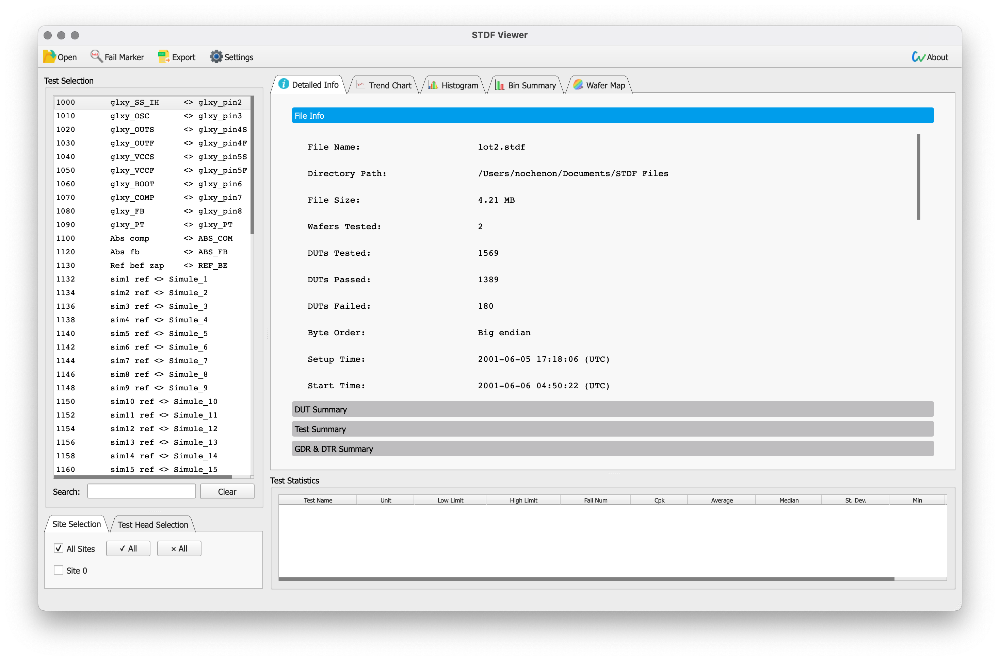
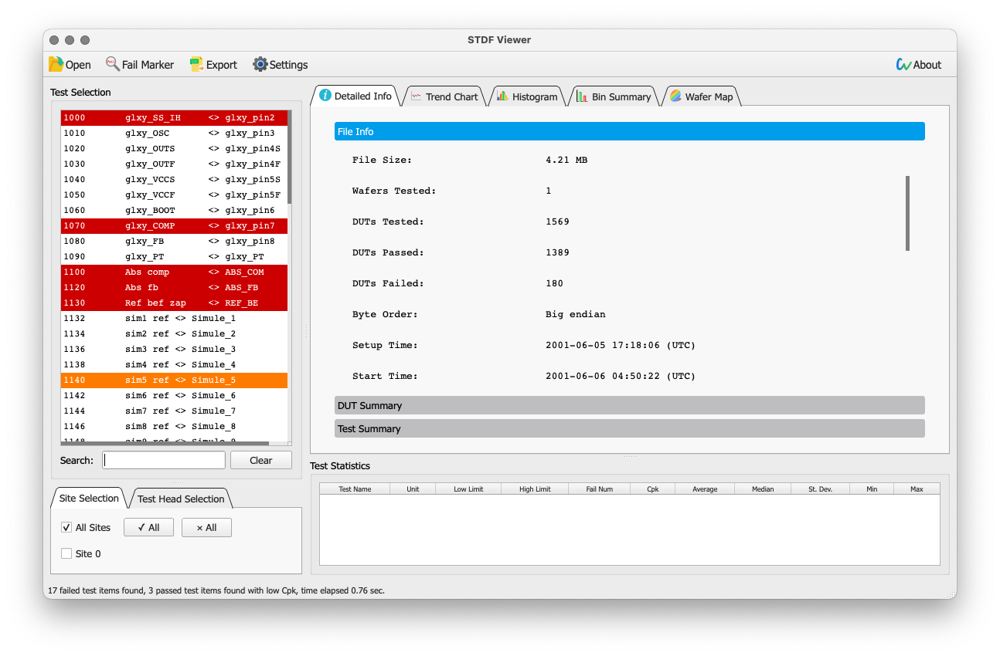
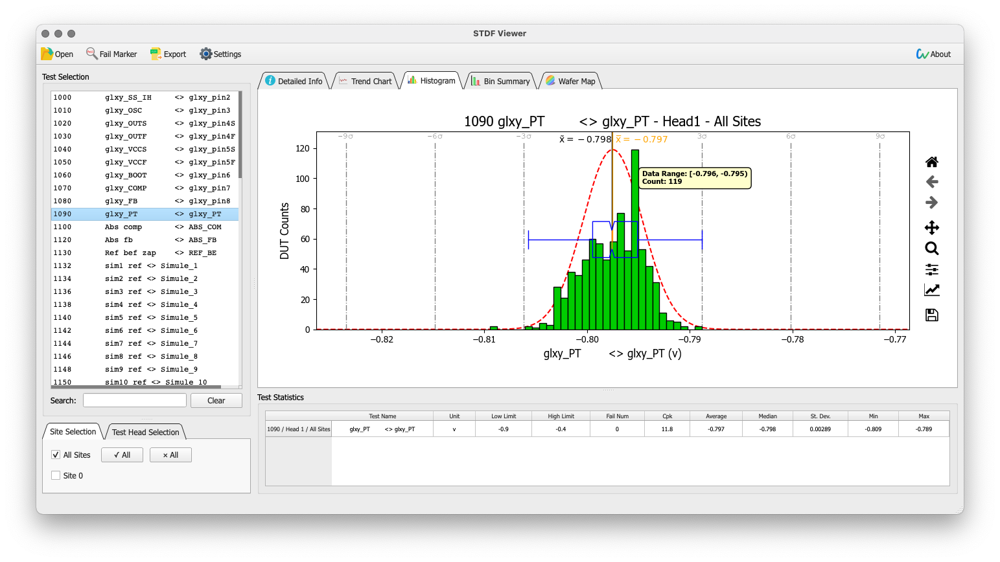
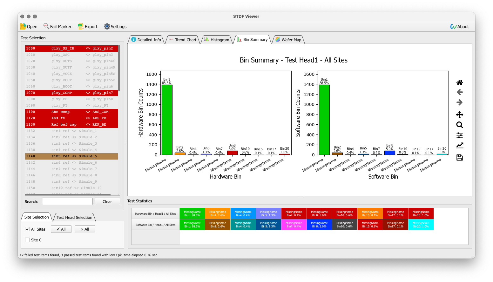
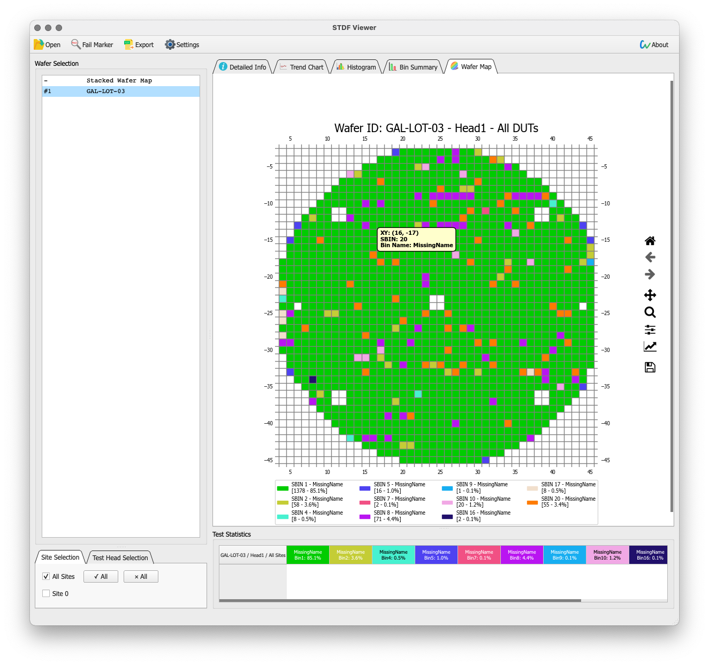
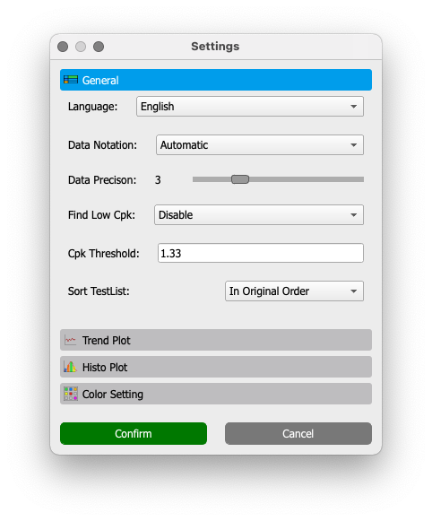
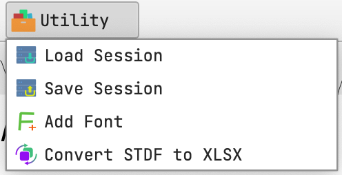

# STDF Viewer 

[](https://github.com/noonchen/STDF-Viewer/actions/workflows/build.yml)  [](https://lgtm.com/projects/g/noonchen/STDF-Viewer/context:python)  [](https://app.codacy.com/gh/noonchen/STDF-Viewer?utm_source=github.com&utm_medium=referral&utm_content=noonchen/STDF-Viewer&utm_campaign=Badge_Grade_Settings)  [](https://github.com/noonchen/STDF-Viewer/releases/latest)  [](https://github.com/noonchen/STDF-Viewer/releases)  [](https://github.com/noonchen/STDF-Viewer/blob/main/LICENSE)

STDF Viewer是一款用于分析半导体测试STDF报告的免费、高效的图形化界面程序。

作者：Noon Chen <chennoon233@foxmail.com>

| [English](README.md) |



## 目录
- [**编译**](#编译)
- [使用方法](#使用方法)
  - [**打开STDF文件**](#打开stdf文件)
  - [**合并STDF文件**](#合并stdf文件)
  - [**寻找失效测项**](#寻找失效测项)
  - [**查看DUT测试信息**](#查看dut测试信息)
  - [**显示GDR和DTR信息**](#显示gdr和dtr信息)
  - [**分析测试数据**](#分析测试数据)
    - [**测试原始数据**](#测试原始数据)
    - [**趋势图**](#趋势图)
    - [**直方图**](#直方图)
  - [**Bin桶分布**](#bin桶分布)
  - [**查看晶圆图**](#查看晶圆图)
  - [**读取特定DUT的所有测试数据**](#读取特定dut的所有测试数据)
    - [**在图像里中**](#在图像里中)
  - [**生成Excel报告**](#生成excel报告)
  - [**设置**](#设置)
  - [**实用工具**](#实用工具)
- [遇到问题？](#遇到问题)
- [鸣谢](#鸣谢)
- [软件许可证](#软件许可证)
- [下载](#下载)
- [合作](#合作)


## 编译

1. 安装Python 3.9+以及[Rust](https://www.rust-lang.org/tools/install)。
2. 安装Python轮子，其中`maturin`是编译`rust_stdf_helper`的必须项。

```
pip install -r requirements.txt
pip install maturin
```

3. 编译`rust_stdf_helper`。

```
cd ./deps/rust_stdf_helper
maturin build -f -r
```

4. 安装`rust_stdf_helper`，编译出来的轮子位于`target/wheels/`。
```
pip install /path/to/whl/file
```

5. 至此你可以直接运行`STDF-Viewer.py`，也可以用你顺手的工具打包成一个可执行程序。


## 使用方法

### **打开STDF文件**

STDF Viewer可处理的文件为V4、V4-2007标准的STDF，ZIP*、GZ以及BZIP压缩的STDF文件可以不用解压直接打开。

打开的方式有三种:

1. 打开软件后点击工具栏的`打开`选择文件。
2. 文件右键选择用STDF Viewer打开（macOS由于pyinstaller的原因暂时不支持）。
3. 将文件直接拖到程序界面上。

如果一次选择了多个文件，那么比对模式自动开启。

***注意**: ZIP格式的STDF文件支持有限，需要满足以下条件:*
- *没有密码*
- *一个ZIP只包含一个文件*
- ~~*ZIP的压缩方法为`DEFLATE`，这是各个平台的主流的压缩方式*~~ (V4.0.0)

<br>

### **合并STDF文件**

(V4.0.0) 点击工具栏的`合并`按钮打开合并面板, 同一个组里的多个文件最终会合并，且序号为0的文件为第一个文件。


支持添加多个合并组，组和组之间会进行对比。


<br>

### **寻找失效测项**

点击工具栏的`标记失效`可以把所有存在失效测项标为<span style="color:red">红色</span>，如果在`设置`里开启了`搜索低Cpk测项`，Cpk低于阈值（也可在`设置`中设置）的测项会标为<span style="color:orange">橙色</span>。



<br>

### **查看DUT测试信息**

DUT测试信息位于`STDF信息` -> `DUT详情`。表格中每行代表一个DUT，失效的DUT会被标为<span style="color:red">红色</span>。

(V4.0.0) 被顶替的DUT会被标为灰色。通常的STDF文件会包含几K+ DUT，为了性能考虑，`DUT详情` 不会一次性把数据都加载到表格中，不过如果你想加载的话，表格右键选择`加载所有行`即可。

如果STDF包含多head/site测试数据，显示的DUT会根据`选择Site/Head`进行过滤。

DUT信息可以按照每列进行排列，点击对应列即可。


<br>

### **显示GDR和DTR信息**

所有GDR (Generic Data Record)和DTR (Datalog Text Record) 数据列在`STDF信息` -> `GDR & DTR汇总`中。这两种Record的精确位置不好确定，表中给出了相对于PIR/PRR的位置。

GDR的`值`的每一行代表一个V1数据，按照`{V1序列} {V1数据类型}: {V1数据}`的格式进行打印。

和DUT详情一样，想全部加载数据右键点击`加载所有行`。

*注意：`Bn`和`Dn`格式的数据使用十六进制进行表示*


<br>

### **分析测试数据**

***提示**: 功能测试 FTR 没有测试值，在趋势图和直方图中用的是FTR的测试标识（Test Flag）进行绘图*

STDF文件中所有的测项会显示在`选择测项`，可以多选。下方提供搜索框进行过滤。

测项的统计信息（Cpk、平均值、方差等）显示在`统计信息`中。

#### **测试原始数据**
选择测项后在`STDF信息` -> `数据详情`查看。表格中每行代表一个DUT，每列代表一个测项。


#### **趋势图**
显示测试值随DUT变化的趋势图，横轴为测试值，横轴为所选的head/site包含的所有DUT的序号。鼠标停留到数据点上可以查看详细数据。


如果STDF中测项开启了PAT，动态的上下限也会画出来。


#### **直方图**
显示测项的数据分布，纵轴为测试值。~~鼠标停留到区间上可以查看具体计数。~~



<br>

### **Bin桶分布**
显示HBIN和SBIN桶的分布。

`统计信息`为每个Bin编号、名称和百分比，空的Bin自动隐藏.



<br>

### **查看晶圆图**
`晶圆图`只会在STDF文件存在晶圆测试信息（WCR、WIR、WRR）的时候开启。 

`选择晶圆`的第一行（`Stacked Wafer Map`）是当前文件里失效个数的分布图，每个(X, Y)坐标的数字代表这个失效的DUT的个数。


`选择晶圆`的其它行则是文件中记录的晶圆数据，每个方块的颜色由SBIN决定，可在设置中自定义。



点击图例的图标可以隐藏对应的SBIN。


<br>

### **读取特定DUT的所有测试数据**
有时你可能需要某几个DUT的所有测项的值，如下图所示，在STDF Viewer中有多种方式可以实现。


#### **在`DUT详情`中**
选择行后，右键选择`读取DUT详细数据`。


#### **在`数据详情`中**
选择单元格后，右键选`读取DUT详细数据`。


#### **在图像里中**
图中右键点击`数据选择模式`，圈出感兴趣的地方后，再点击右键选择`读取DUT详细数据`，记得善用图例隐藏功能。


<br>

### **生成Excel报告**
程序显示的内容基本上都可以导出到报告里。


`Report Content Selection`的每个选项对应Excel里的sheet。

- `文件详情`：文件信息，包括MIR、MRR、ATR、RDR和SDR
- `DUT详情`：DUT信息
- `趋势图`：趋势图+统计信息
- `直方图`：直方图+统计信息
- `Bin桶分布`：Bin桶分布+Bin桶统计
- `晶圆图`：所有晶圆图
- `统计信息`：所选测项的统计信息
- `GDR & DTR汇总`：所有的GDR和DTR

报告的图片/数据数量取决于`已选测项`的内容和head/site的选择。

<br>

### **设置**
STDF Viewer提供了全局设置界面，可以用来更改程序界面中或导出报告中对图像元素、site/bin的颜色等等，可自行尝试修改。



### **实用工具**
4.0.0在工具栏增加了`实用工具`按钮。



#### **加载/保存缓存**

你可以把当间缓存保存下来，避免重复读去STDF文件。

#### **添加字体**
和之前版本相比，现只需选择一个.ttf格式的字体文件，在`设置`中选择即可。

#### **STDF转换**
此工具可以把STDF的所有record存到xlsx文件，便于分析和调试文件。

<br>

## 遇到问题？
如果在使用过程中遇到问题，按照以下步骤进行：
1. 打开STDF-Viewer后点击右上角的`关于`。
2. 点击`调试`按钮打开调试界面。
3. 点击`显示Log内容`打印出历史报告；如果错误是和文件有关，点击`分析文件Record类型`后选择出错的文件。
4. 点击`保存结果`保存结果，在GitHub上创建个issue。


## 鸣谢

STDF Viewer使用了下列开源项目的代码，感谢作者们：

 - [rust-stdf](https://github.com/noonchen/rust-stdf) <- 我是作者
 - [pyqtgraph](https://github.com/pyqtgraph/pyqtgraph)
 - [flate2](https://crates.io/crates/flate2)
 - [bzip2](https://crates.io/crates/bzip2)
 - [rusqlite](https://crates.io/crates/rusqlite)

 4.0.0及新版本不再使用：
 - ~~[minizip](https://www.winimage.com/zLibDll/minizip.html)~~
 - ~~[hashmap](https://gist.github.com/warmwaffles/6fb6786be7c86ed51fce)~~
 - ~~[message_queue](https://github.com/LnxPrgr3/message_queue)~~

 3.0.5及新版本不再使用：
 - ~~[pystdf](https://github.com/cmars/pystdf)~~

<br>

## 软件许可证

STDF Viewer采用GPL V3.0，程序完全免费，由于使用本软件导致的任何问题，作者概不负责，也请使用者抱着怀疑的态度使用本软件。

我为STDF Viewer设计的图标采用[Attribution-NonCommercial 4.0 (CC BY-NC 4.0)](https://creativecommons.org/licenses/by-nc/4.0/)许可。

<br>

## 下载

[点击这里](https://github.com/noonchen/STDF-Viewer/releases)

<br>

## 合作

欢迎各种PR和Issue～